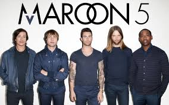

#  Band Website : MAROON 5
 

This is a website made using HTML and css for the music band Maroon 5 !! I created this website after going through the Web Dev series by Web Dev Simplified on Youtube!

## Getting Started

To build a similar website, you need to have a very basic knowledge of HTML and CSS and javascript! Right now the website has no js code and hence has no backend to it! I will be adding the backend code soon!

### Prerequisites

No libraries are needed to build the front end of this website. **Visual Studio Code** may come in handy while writing the code ! The plugin *Live Server* can be installed for hastlefree updation of the site on the go!

You should have the images that you want to include in your website in the Images folder which is inside the sit repo!
